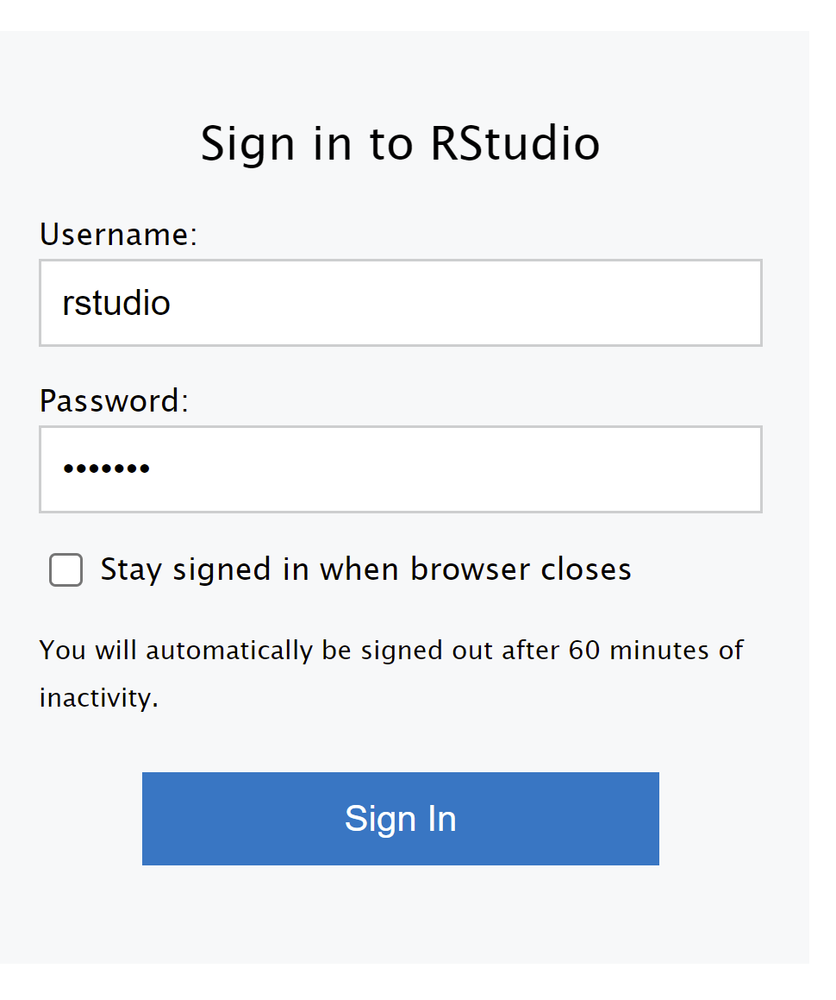
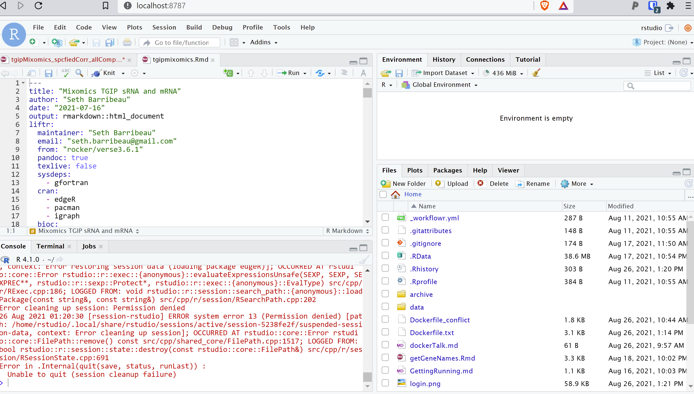

---
# Using Docker for analysis: Why? How?
---
## What's the problem?

1. We do complicated stuff on computers.
   1.1 Systems differ, dependencies matter, stuff breaks.
2. We do science.
   2.1 Science should be repeatable.
3. When things change across platforms, or over time, the results may not be repeatable, and the reason why might not be clear.

---

## How can we fix this?

There are multiple solutions including virtualization, cloud computing, and *containerized computing*.

--- 

# Containers
- Tiny set of instructions that can be run on ANY computer.
- Creates a "mini-computer" that is built to your requirments to mimic settings of your analyses.
- Allows others to run your code and presumably recreate your analyses.

---

# Docker
- Docker is one containerization tool. (www.docker.com)
  - It's commonly used for scientific computing.
  - It has a cute whale icon. 
   

--- 

# How to Docker from R
<!-- I was using R for a pretty intense analysis that takes a long time to run. To convert this into a Docker, I found  -->
### First: install Docker
### Then, use `liftr` Package in R.
https://liftr.me/articles/liftr-intro.html

---

Uses metadata from your ```.Rmd``` file to set the stage.

```{r}
---
title: "Mixomics TGIP sRNA and mRNA"
author: "Seth Barribeau"
date: "2021-07-16"
output: rmarkdown::html_document
liftr:
  maintainer: "Seth Barribeau"
  email: "seth.barribeau@gmail.com"
  from: "rocker/verse3.6.1" # <- this is where it finds the R version
  pandoc: true              # <- stuff for making report docs
  texlive: false
  sysdeps:
    - gfortran
  cran:                     # <- packages you need for your analysis
    - edgeR                 # from CRAN
    - pacman
    - igraph
  bioc:
    - mixOmics/6.16.3       # from Bioconductor (note version no.)
---
```
---

Within R, you can use the `liftr` package to create a Docker.

```{r}
pacman::p_load("here", 'liftr')             # load couple packages
input=paste0(here(), '/tgipmixomicsb.Rmd')  # <- name of my Rmd file
lift(input)                                 # <- create Docker file

```

--- --------------------------------

### Dockerfile:
Contains all the info to make your docker image. <!-- partial -->
```{docker}
FROM rocker/verse3.6.1

MAINTAINER Seth Barribeau <seth.barribeau@gmail.com>

# System dependencies for required R packages
RUN  rm -f /var/lib/dpkg/available \
  && rm -rf  /var/cache/apt/* \
  && apt-get update -qq \
  && apt-get install -y --no-install-recommends \
    ca-certificates \
    libssl-dev \
    libcurl4-openssl-dev \
    libxml2-dev \
    git

RUN apt-get update -qq && apt-get install -y --no-install-recommends gfortran
```
--- 
I needed to tweak this on my computer. Might be easier on non-windows platforms. 

See the Dockerfile at https://github.com/sethbarr/tgip_mixomic_2/ for where I adjusted things.

---
To actually make the docker image, you need to run the following commands:
```{bash}
docker build -t mixomic . 
docker run --rm -it -p 8787:8787/tcp -v '/'$(pwd):/home/rstudio mixomic:latest
```

--- 

This should then make a website that you can access at: http://localhost:8787/ 



---



---


---

